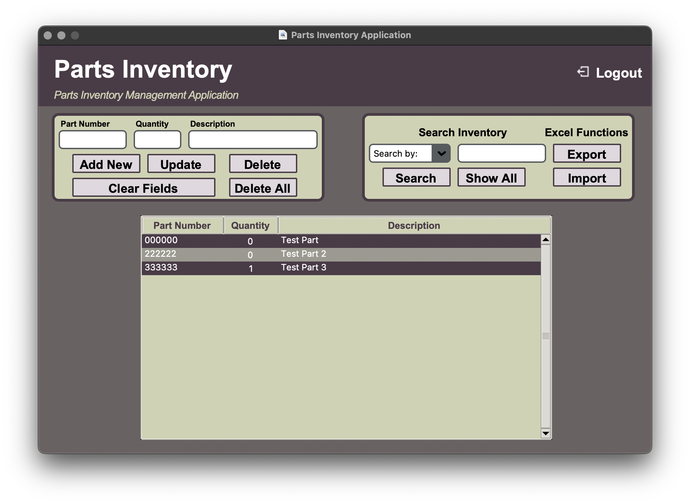

# Part Inventory Application
The Parts Inventory Application is just that. A desktop application to manage parts (or anything else if customized). It is simple but, I plan to expand it with the help from others.

## Please note:
I am new to Python programming and have no formal background. I use projects like this to learn. Just working on this has opened my eyes to a lot and my mind is craving more. Hopefully, with the help of the community, we can build on this application and learn together.

I am trying to learn how to organize my application structure. I was looking at  to get a better idea of what files and folders are needed/required and how to structure it all. If anyone would like to help with that, I'd greatly appreciate it!

